# Jarkom Modul 2 2026 K-09

| Nama | NRP |
| :--- | :--- |
| Sultan Ahmad Maulana Bahyshidqi | 5027251070 |
| Muhammad Razzan Azizi Djauhari | **[ISI NRP RAZZAN]** |

Dokumentasi pengerjaan Praktikum Modul 2 Komunikasi Data & Jaringan Komputer menggunakan GNS3 dengan prefix jaringan `10.68.x.x` dan domain internal `k09.com`.

---

## 1. Konfigurasi Topologi dan IP Address

Rootkit berfungsi sebagai router sentral yang terhubung ke NAT serta lima jaringan internal.

**Nama file foto:** `images/soal1/topologi.png`

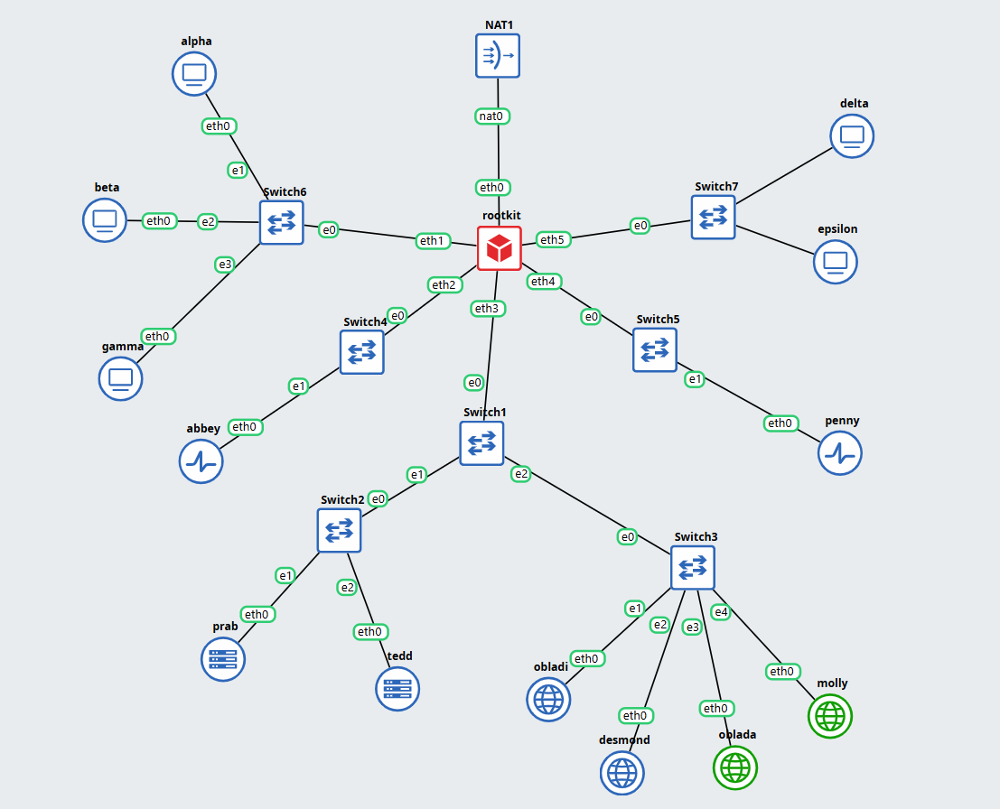


### Skema interface Rootkit

| Interface | Jaringan | Node |
| :--- | :--- | :--- |
| `eth0` | NAT / WAN | Internet |
| `eth1` | `10.68.1.0/24` | alpha, beta, gamma |
| `eth2` | `10.68.2.0/24` | abbey |
| `eth3` | `10.68.3.0/24` | prab, tedd, obladi, desmond, oblada, molly |
| `eth4` | `10.68.4.0/24` | penny |
| `eth5` | `10.68.5.0/24` | delta, epsilon |

Konfigurasi `/etc/network/interfaces` pada Rootkit:

```text
auto eth0
iface eth0 inet dhcp

auto eth1
iface eth1 inet static
    address 10.68.1.1
    netmask 255.255.255.0

auto eth2
iface eth2 inet static
    address 10.68.2.1
    netmask 255.255.255.0

auto eth3
iface eth3 inet static
    address 10.68.3.1
    netmask 255.255.255.0

auto eth4
iface eth4 inet static
    address 10.68.4.1
    netmask 255.255.255.0

auto eth5
iface eth5 inet static
    address 10.68.5.1
    netmask 255.255.255.0
```

### Pengalamatan host

| Node | IP Address | Gateway |
| :--- | :--- | :--- |
| alpha | `10.68.1.2/24` | `10.68.1.1` |
| beta | `10.68.1.3/24` | `10.68.1.1` |
| gamma | `10.68.1.4/24` | `10.68.1.1` |
| abbey | `10.68.2.2/24` | `10.68.2.1` |
| prab | `10.68.3.2/24` | `10.68.3.1` |
| tedd | `10.68.3.3/24` | `10.68.3.1` |
| obladi | `10.68.3.4/24` | `10.68.3.1` |
| desmond | `10.68.3.5/24` | `10.68.3.1` |
| oblada | `10.68.3.6/24` | `10.68.3.1` |
| molly | `10.68.3.7/24` | `10.68.3.1` |
| penny | `10.68.4.2/24` | `10.68.4.1` |
| delta | `10.68.5.2/24` | `10.68.5.1` |
| epsilon | `10.68.5.3/24` | `10.68.5.1` |

Contoh konfigurasi host Alpha:

```text
auto eth0
iface eth0 inet static
    address 10.68.1.2
    netmask 255.255.255.0
    gateway 10.68.1.1
```

Verifikasi konfigurasi pada Rootkit:

```bash
ip -br a
ip route
```

**Nama file foto:** `images/soal1/rootkit-ip.png`

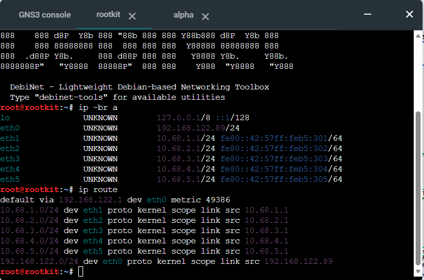

Verifikasi konfigurasi pada Alpha:

```bash
ip -br a
ip route
```

**Nama file foto:** `images/soal1/alpha-ip.png`

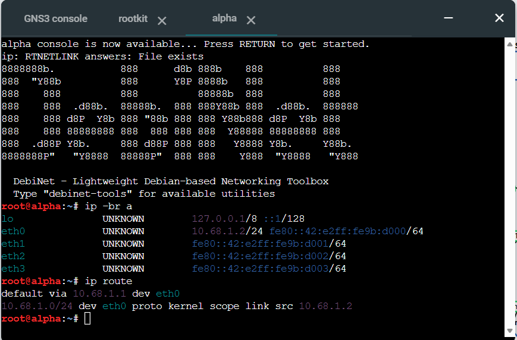


---

## 2. Akses Internet melalui Rootkit

Rootkit mengaktifkan IP forwarding dan NAT agar seluruh host internal dapat mengakses internet.

Pada interface WAN `eth0` Rootkit:

```text
auto eth0
iface eth0 inet dhcp
    up sysctl -w net.ipv4.ip_forward=1
    up iptables -t nat -C POSTROUTING -s 10.68.0.0/16 -o eth0 -j MASQUERADE 2>/dev/null || iptables -t nat -A POSTROUTING -s 10.68.0.0/16 -o eth0 -j MASQUERADE
```

`net.ipv4.ip_forward=1` membuat Rootkit dapat meneruskan paket antarmuka, sedangkan `MASQUERADE` membuat alamat host internal dapat keluar melalui IP WAN Rootkit.

Verifikasi pada Rootkit:

```bash
cat /proc/sys/net/ipv4/ip_forward
iptables -t nat -L POSTROUTING -n -v
```

**Nama file foto:** `images/soal2/nat-rule.png`

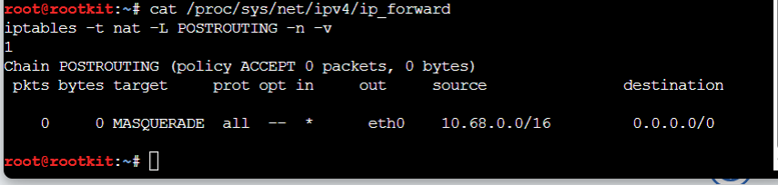


Verifikasi internet dari Alpha:

```bash
ping -c 3 8.8.8.8
```

**Nama file foto:** `images/soal2/ping-internet.png`

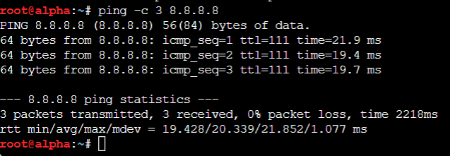


---

## 3. Routing Internal dan Resolver Awal

Setiap host menggunakan Rootkit sebagai default gateway. Karena Rootkit terhubung langsung ke seluruh subnet dan IP forwarding sudah aktif, tidak diperlukan static route tambahan pada masing-masing host.

Contoh pengujian lintas subnet:

```bash
# Dari Alpha menuju Prab
ping -c 3 10.68.3.2

# Dari Prab menuju Alpha
ping -c 3 10.68.1.2
```

**Nama file foto:** `images/soal3/routing-internal.png`

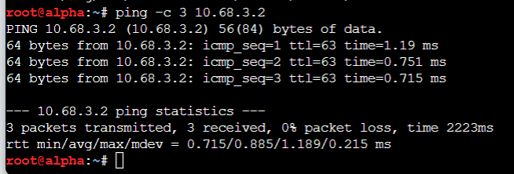


Sebelum DNS internal aktif, seluruh host non-router memakai resolver `192.168.122.1`.

Tambahkan pada `/etc/network/interfaces`:

```text
up echo "nameserver 192.168.122.1" > /etc/resolv.conf
```

Contoh konfigurasi Alpha:

```text
auto eth0
iface eth0 inet static
    address 10.68.1.2
    netmask 255.255.255.0
    gateway 10.68.1.1
    up echo "nameserver 192.168.122.1" > /etc/resolv.conf
```

Verifikasi:

```bash
cat /etc/resolv.conf
ping -c 3 8.8.8.8
ping -c 3 google.com
```

**Nama file foto:** `images/soal3/resolver-awal.png`

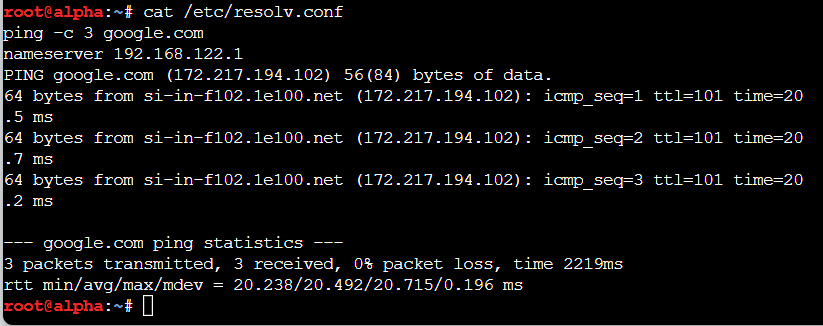


---

## 4. DNS Internal Prab dan Tedd

Prab digunakan sebagai DNS primary untuk zone `k09.com`, sedangkan Tedd menjadi DNS secondary.

### 4.1 Prab sebagai DNS Primary

Install BIND:

```bash
apt update
apt install -y bind9 bind9utils dnsutils
```

Konfigurasi `/etc/bind/named.conf.options`:

```text
options {
    directory "/var/cache/bind";

    recursion yes;
    allow-query { any; };

    forwarders {
        192.168.122.1;
    };

    dnssec-validation auto;

    listen-on { any; };
    listen-on-v6 { none; };
};
```

Konfigurasi `/etc/bind/named.conf.local`:

```text
zone "k09.com" {
    type master;
    file "/etc/bind/db.k09.com";

    notify yes;
    allow-transfer {
        10.68.3.3;
    };
};
```

Zone awal `/etc/bind/db.k09.com`:

```text
$TTL 86400

@   IN  SOA prab.k09.com. root.k09.com. (
        2026093001
        3600
        1800
        604800
        86400
)

@       IN  NS  prab.k09.com.
@       IN  NS  tedd.k09.com.

prab    IN  A   10.68.3.2
tedd    IN  A   10.68.3.3

@       IN  A   10.68.4.2
```

Validasi dan jalankan DNS Prab:

```bash
named-checkconf
named-checkzone k09.com /etc/bind/db.k09.com
service named restart
```

Setelah service aktif, verifikasi jawaban authoritative dari Prab:

```bash
dig @10.68.3.2 k09.com
```

**Nama file foto:** `images/soal4/dns-prab.png`

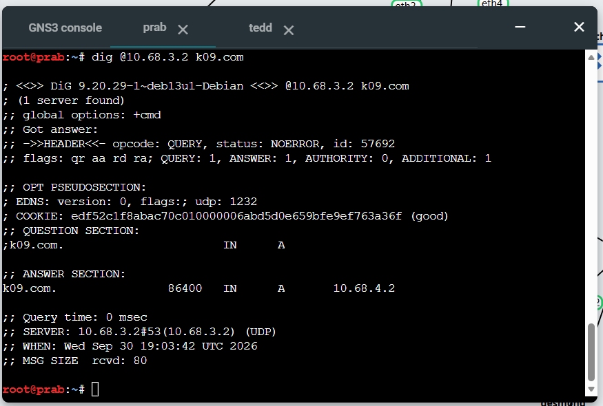

### 4.2 Tedd sebagai DNS Secondary

Konfigurasi `/etc/bind/named.conf.local` pada Tedd:

```text
zone "k09.com" {
    type slave;
    masters {
        10.68.3.2;
    };
    file "/var/cache/bind/db.k09.com";
};
```

Restart Tedd dan cek hasil transfer:

```bash
named-checkconf
service named restart
ls -l /var/cache/bind/
```

File `db.k09.com` akan disalin dari Prab ke `/var/cache/bind/`.

Verifikasi jawaban authoritative dari Tedd:

```bash
dig @10.68.3.3 k09.com
```

**Nama file foto:** `images/soal4/dns-tedd.png`

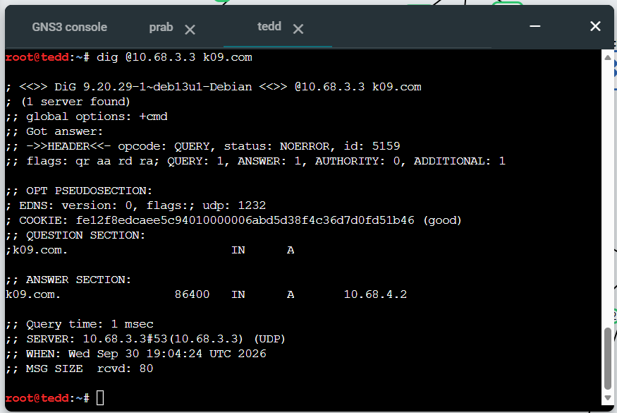

### 4.3 Resolver Host Non-Router

Setelah Prab dan Tedd aktif, resolver seluruh host non-router diubah menjadi:

```text
nameserver 10.68.3.2
nameserver 10.68.3.3
nameserver 192.168.122.1
```

Contoh verifikasi konfigurasi resolver dari Alpha:

```bash
cat /etc/resolv.conf
```

**Nama file foto:** `images/soal4/resolver-internal.png`

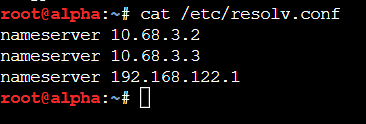

Setelah resolver benar, pengujian resolusi nama dapat dilakukan dengan:

```bash
dig k09.com
dig prab.k09.com
dig tedd.k09.com
ping -c 3 google.com
```

---

## 5. Hostname dan A Record Setiap Node

Setiap node diberi hostname sesuai nama entitas.

Contoh pada Alpha:

```bash
echo "alpha" > /etc/hostname
hostname alpha
hostname
cat /etc/hostname
```

Pola yang sama diterapkan pada:

```text
rootkit
alpha
beta
gamma
delta
epsilon
prab
tedd
abbey
penny
obladi
desmond
oblada
molly
```

**Nama file foto:** `images/soal5/hostname.png`

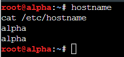


Pada Prab, record berikut ditambahkan ke `/etc/bind/db.k09.com`:

```text
rootkit     IN  A   10.68.3.1

alpha       IN  A   10.68.1.2
beta        IN  A   10.68.1.3
gamma       IN  A   10.68.1.4

abbey       IN  A   10.68.2.2

obladi      IN  A   10.68.3.4
desmond     IN  A   10.68.3.5
oblada      IN  A   10.68.3.6
molly       IN  A   10.68.3.7

penny       IN  A   10.68.4.2

delta       IN  A   10.68.5.2
epsilon     IN  A   10.68.5.3
```

Serial SOA dinaikkan dari:

```text
2026093001
```

menjadi:

```text
2026093002
```

Lalu:

```bash
named-checkconf
named-checkzone k09.com /etc/bind/db.k09.com
service named restart
```

Verifikasi dari client:

```bash
dig alpha.k09.com
dig rootkit.k09.com
```

Record node lainnya dapat diverifikasi dengan pola command yang sama.

**Nama file foto:** `images/soal5/dig-hostname.png`

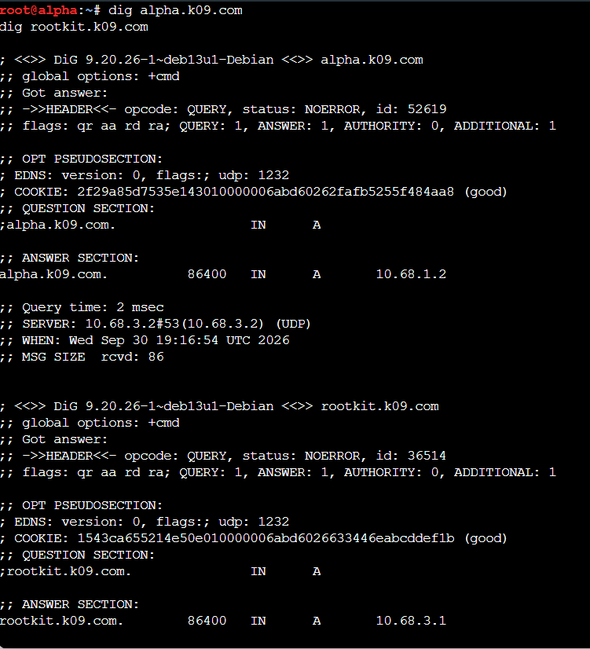


---

## 6. Zone Transfer dan Sinkronisasi SOA

Serial SOA pada Prab dan Tedd dibandingkan untuk memastikan keduanya memiliki versi zone yang sama.

```bash
dig @10.68.3.2 k09.com SOA +short
dig @10.68.3.3 k09.com SOA +short
```

Target serial:

```text
Prab : 2026093002
Tedd : 2026093002
```

**Nama file foto:** `images/soal6/soa-sync.png`

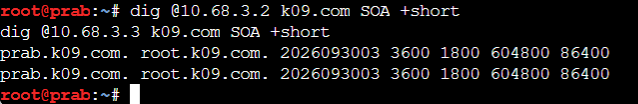


Zone transfer diuji dari Tedd:

```bash
dig @10.68.3.2 k09.com AXFR
```

AXFR hanya diizinkan dari Tedd karena Prab memiliki:

```text
allow-transfer {
    10.68.3.3;
};
```

**Nama file foto:** `images/soal6/axfr-tedd.png`

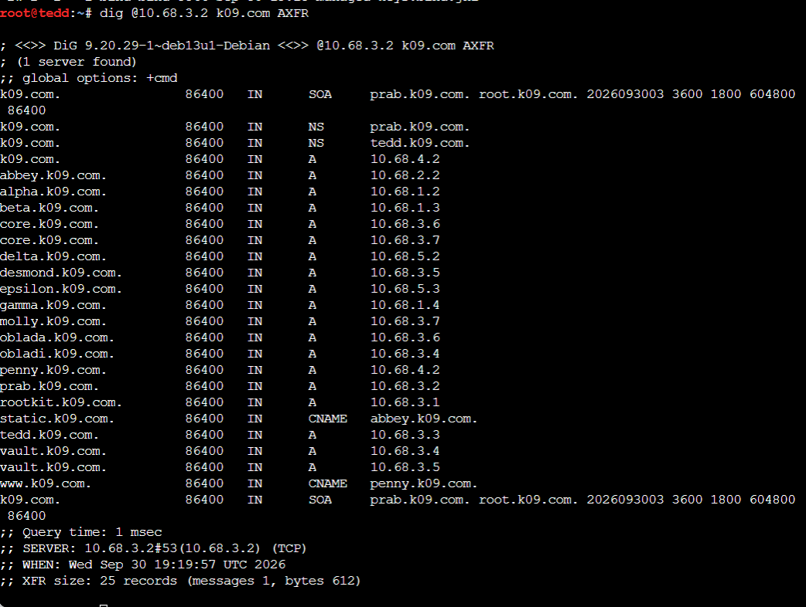


---

## 7. Record Vault, Core, WWW, dan Static

Pada Prab ditambahkan A record untuk area Vault dan Core serta CNAME untuk `www` dan `static`.

Edit `/etc/bind/db.k09.com`:

```text
vault       IN  A       10.68.3.4
vault       IN  A       10.68.3.5

core        IN  A       10.68.3.6
core        IN  A       10.68.3.7

www         IN  CNAME   penny.k09.com.
static      IN  CNAME   abbey.k09.com.
```

Serial SOA dinaikkan:

```text
2026093002 -> 2026093003
```

Validasi dan restart:

```bash
named-checkconf
named-checkzone k09.com /etc/bind/db.k09.com
service named restart
```

Verifikasi dari client:

```bash
dig vault.k09.com
dig core.k09.com
dig www.k09.com
dig static.k09.com
```

Hasil yang diharapkan:

```text
vault.k09.com
-> 10.68.3.4
-> 10.68.3.5

core.k09.com
-> 10.68.3.6
-> 10.68.3.7

www.k09.com
-> penny.k09.com
-> 10.68.4.2

static.k09.com
-> abbey.k09.com
-> 10.68.2.2
```

**Nama file foto:** `images/soal7/vault-core.png`

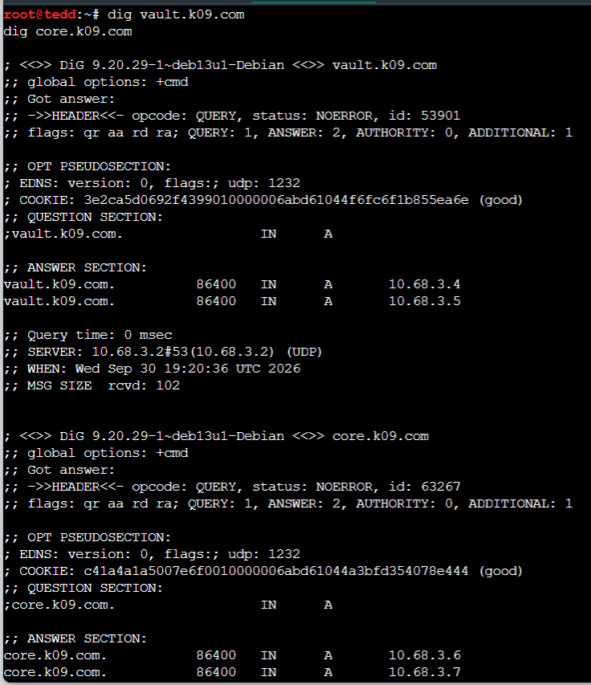


Verifikasi yang sama dapat dilakukan dari client lain untuk memastikan hasil DNS konsisten.

**Nama file foto:** `images/soal7/cname-client.png`

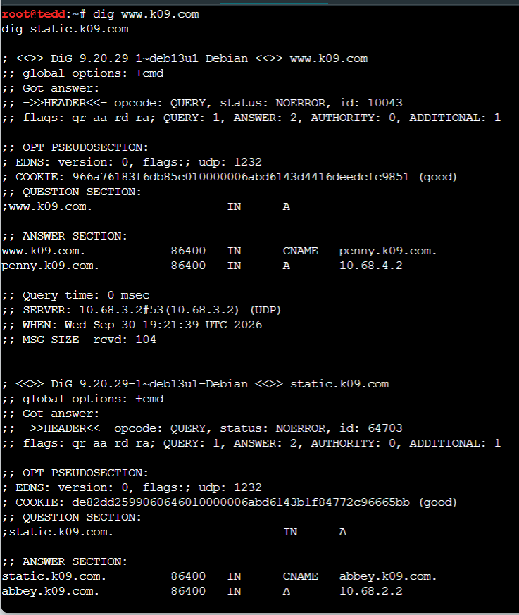


---

## 8. Reverse DNS dan PTR

Reverse zone dibuat pada Prab untuk jaringan yang berisi Abbey, Vault/Core, dan Penny.

### 8.1 Deklarasi reverse zone pada Prab

Tambahkan ke `/etc/bind/named.conf.local`:

```text
zone "2.68.10.in-addr.arpa" {
    type master;
    file "/etc/bind/db.10.68.2";

    notify yes;
    allow-transfer {
        10.68.3.3;
    };
};

zone "3.68.10.in-addr.arpa" {
    type master;
    file "/etc/bind/db.10.68.3";

    notify yes;
    allow-transfer {
        10.68.3.3;
    };
};

zone "4.68.10.in-addr.arpa" {
    type master;
    file "/etc/bind/db.10.68.4";

    notify yes;
    allow-transfer {
        10.68.3.3;
    };
};
```

PTR yang digunakan:

```text
# /etc/bind/db.10.68.2
2   IN  PTR abbey.k09.com.

# /etc/bind/db.10.68.3
4   IN  PTR vault.k09.com.
5   IN  PTR vault.k09.com.
6   IN  PTR core.k09.com.
7   IN  PTR core.k09.com.

# /etc/bind/db.10.68.4
2   IN  PTR penny.k09.com.
```

Validasi:

```bash
named-checkconf
named-checkzone 2.68.10.in-addr.arpa /etc/bind/db.10.68.2
named-checkzone 3.68.10.in-addr.arpa /etc/bind/db.10.68.3
named-checkzone 4.68.10.in-addr.arpa /etc/bind/db.10.68.4
service named restart
```

Verifikasi Prab:

```bash
dig @10.68.3.2 -x 10.68.2.2
dig @10.68.3.2 -x 10.68.3.4
dig @10.68.3.2 -x 10.68.3.6
dig @10.68.3.2 -x 10.68.4.2
```

**Nama file foto:** `images/soal8/reverse-prab.png`

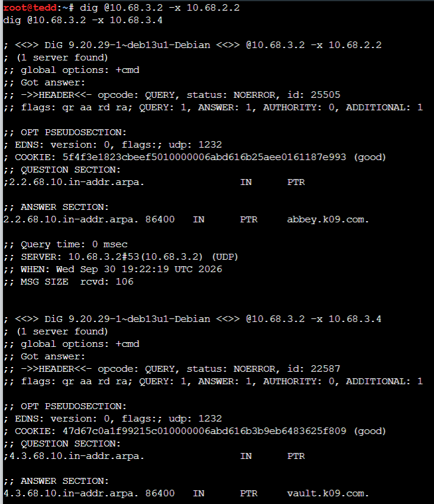


### 8.2 Reverse zone pada Tedd

Pada Tedd:

```text
zone "2.68.10.in-addr.arpa" {
    type slave;
    masters {
        10.68.3.2;
    };
    file "/var/cache/bind/db.10.68.2";
};

zone "3.68.10.in-addr.arpa" {
    type slave;
    masters {
        10.68.3.2;
    };
    file "/var/cache/bind/db.10.68.3";
};

zone "4.68.10.in-addr.arpa" {
    type slave;
    masters {
        10.68.3.2;
    };
    file "/var/cache/bind/db.10.68.4";
};
```

Verifikasi:

```bash
named-checkconf
service named restart
ls -l /var/cache/bind/

dig @10.68.3.3 -x 10.68.2.2
dig @10.68.3.3 -x 10.68.3.4
dig @10.68.3.3 -x 10.68.3.6
dig @10.68.3.3 -x 10.68.4.2
```

Hasil `dig` harus memiliki flag `aa` sebagai tanda jawaban authoritative.

**Nama file foto:** `images/soal8/reverse-tedd.png`

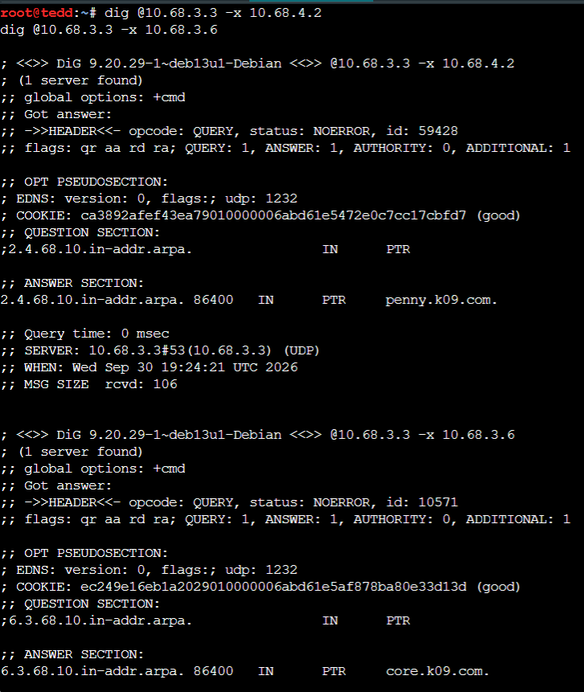


---

## 9. Web Statis Area Vault

Obladi dan Desmond menjalankan Apache sebagai web server statis untuk `vault.k09.com`.

Install Apache:

```bash
apt update
apt install -y apache2
```

Buat directory `/arsip`.

Pada Obladi:

```bash
mkdir -p /var/www/html/arsip
echo "Arsip dari Obladi" > /var/www/html/arsip/obladi.txt
echo "Dokumen Vault" > /var/www/html/arsip/dokumen.txt
```

Pada Desmond:

```bash
mkdir -p /var/www/html/arsip
echo "Arsip dari Desmond" > /var/www/html/arsip/desmond.txt
echo "Dokumen Vault" > /var/www/html/arsip/dokumen.txt
```

Konfigurasi `/etc/apache2/sites-available/vault.conf`:

```apache
<VirtualHost *:80>
    ServerName vault.k09.com

    DocumentRoot /var/www/html

    <Directory /var/www/html/arsip>
        Options +Indexes
        AllowOverride None
        Require all granted
    </Directory>
</VirtualHost>
```

Aktifkan site:

```bash
a2ensite vault.conf
a2dissite 000-default.conf
```

ServerName global:

```bash
echo "ServerName vault.k09.com" > /etc/apache2/conf-available/servername.conf
a2enconf servername
```

Validasi dan restart:

```bash
apache2ctl configtest
service apache2 restart
```

**Nama file foto:** `images/soal9/apache-configtest.png`

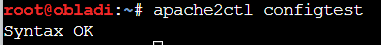


Pengujian dilakukan melalui hostname:

```bash
curl http://vault.k09.com/arsip/
```

Output harus menampilkan `Index of /arsip` beserta isi directory.

**Nama file foto:** `images/soal9/vault-arsip.png`

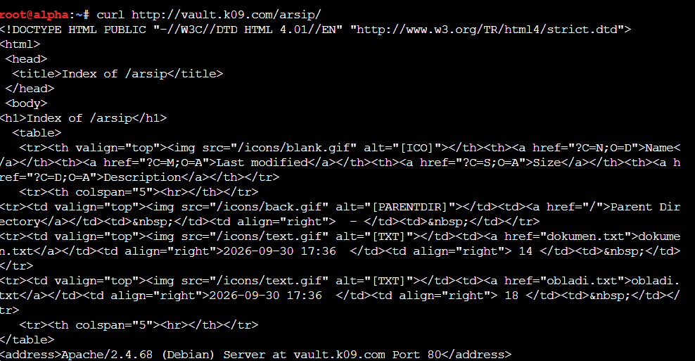


---

## 10. Web Dinamis Area Core

Oblada dan Molly menjalankan web dinamis menggunakan Nginx dan PHP-FPM untuk `core.k09.com`.

Install:

```bash
apt update
apt install -y nginx php-fpm
service php8.4-fpm start
```

Cek socket PHP-FPM:

```bash
ls -l /run/php/
```

Socket yang digunakan:

```text
/run/php/php8.4-fpm.sock
```

### Halaman utama

`/var/www/html/index.php`:

```php
<!DOCTYPE html>
<html>
<head>
    <title>Core K09</title>
</head>
<body>
    <h1>Core K09</h1>
    <p>Halaman beranda dari <?php echo gethostname(); ?>.</p>
    <a href="/profil">Profil</a>
</body>
</html>
```

### Halaman profil

`/var/www/html/profil.php`:

```php
<!DOCTYPE html>
<html>
<head>
    <title>Profil Core</title>
</head>
<body>
    <h1>Profil Core K09</h1>
    <p>Halaman profil dari <?php echo gethostname(); ?>.</p>
</body>
</html>
```

### Konfigurasi Nginx

Buat `/etc/nginx/sites-available/core`:

```nginx
server {
    listen 80;
    server_name core.k09.com;

    root /var/www/html;
    index index.php index.html;

    location / {
        try_files $uri $uri/ =404;
    }

    location = /profil {
        rewrite ^/profil$ /profil.php last;
    }

    location ~ \.php$ {
        include snippets/fastcgi-php.conf;
        fastcgi_pass unix:/run/php/php8.4-fpm.sock;
    }
}
```

Aktifkan:

```bash
ln -s /etc/nginx/sites-available/core /etc/nginx/sites-enabled/core
rm -f /etc/nginx/sites-enabled/default
```

Validasi dan restart:

```bash
nginx -t
service php8.4-fpm restart
service nginx restart
```

**Nama file foto:** `images/soal10/nginx-test.png`

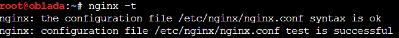


Verifikasi spesifik Oblada:

```bash
curl --resolve core.k09.com:80:10.68.3.6 http://core.k09.com/profil
```

Verifikasi spesifik Molly:

```bash
curl --resolve core.k09.com:80:10.68.3.7 http://core.k09.com/profil
```

URL `/profil` tetap bersih tanpa `.php`, sedangkan Nginx melakukan rewrite secara internal ke `profil.php`.

**Nama file foto:** `images/soal10/core-profil.png`

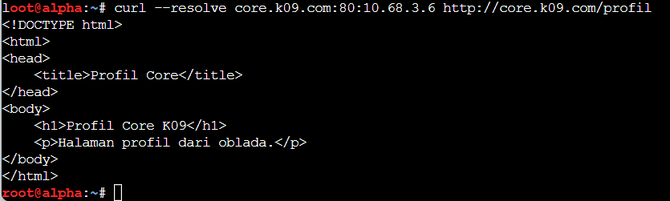


---
